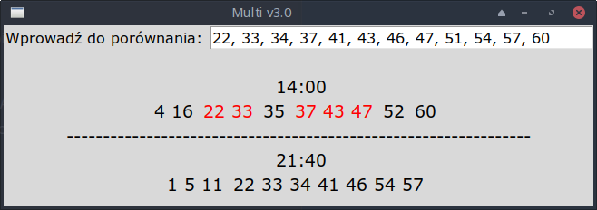

# Multi Multi – złote liczby

Prosta aplikacja desktopowa w Pythonie (Tkinter), która pobierała wyniki losowań Multi Multi (godz. 14:00 i 21:40) i porównywała je z wcześniej zapisanym zestawem tzw. "złotych liczb".  
Bez reklam, bez kont, bez bazy danych. Wystarczyło uruchomić – a wszystko działo się samo.

---

## ℹ️ Informacja techniczna

Projekt powstał w latach wcześniejszych (około 2017), kiedy API serwisu lotto.pl umożliwiało pobieranie danych w prosty sposób.  

Obecnie aplikacja nie działa z powodu zmiany struktury strony źródłowej. Kod pozostaje jako wersja archiwalna – dokumentacja koncepcji, która wciąż ma potencjał rozwoju.

---

## 🖼️ Zrzut ekranu (wersja demo)

Aplikacja obecnie nie działa w trybie online, ale przygotowano wersję demonstracyjną z danymi przykładowymi, widoczną na poniższym zrzucie.



---

## 🎯 Cel aplikacji

- Pokazuje dwa zestawy wyników (14:00 i 21:40)
- Porządkuje liczby rosnąco
- Zaznacza momenty trafienia złotych liczb (planowane)
- Szybki przegląd bez potrzeby odwiedzania strony lotto.pl

---

## 💡 TODO – planowana wersja

- Użycie aktualnego API lub niezależnego źródła danych
- Przeniesienie do wersji mobilnej (Kivy)
- Podświetlanie trafień (np. na czerwono) w GUI
- Opcja edycji zestawu „złotych liczb”
- Dodanie mikrozapłaty (dobrowolnego wsparcia autora) w wersji na Google Play

---

## 🚀 Jak uruchomić wersję demonstracyjną

1. Upewnij się, że masz Pythona 3.6+
2. Uruchom plik `demo.py`, zawierający zasymulowane dane
   ```bash
   python demo.py


---
> Nie wszystkie moje programy przetrwały zmiany świata, ale każdy z nich był odpowiedzią na potrzebę — moją lub czyjąś.

> "Nie jestem programistą z zawodu. Jestem nim z powołania."
